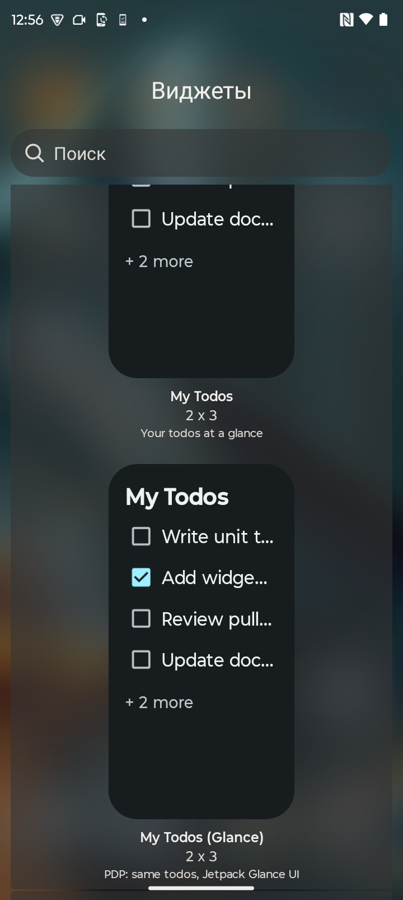
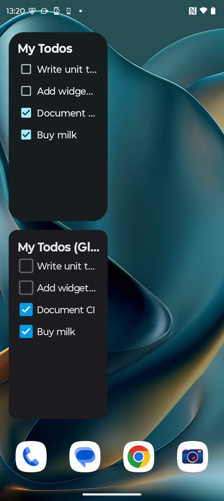
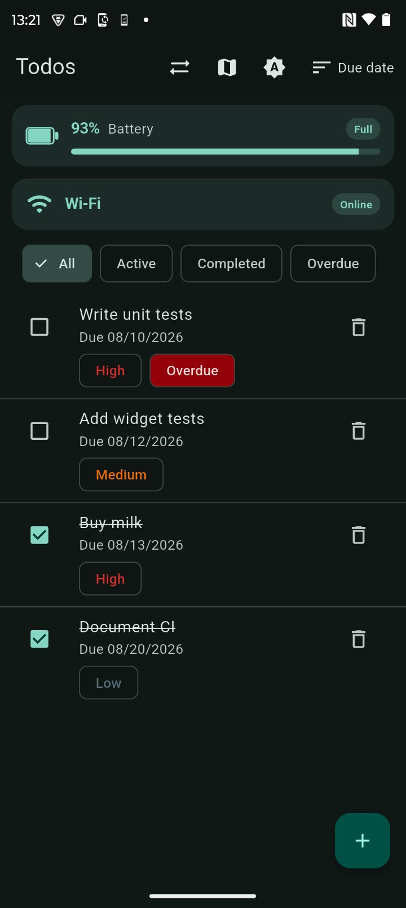
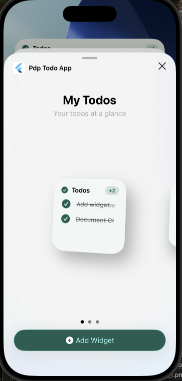
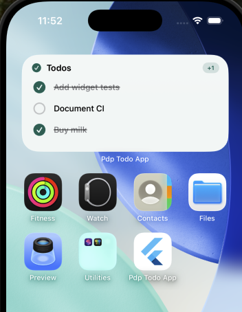
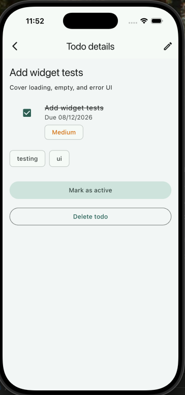

# PDP Todo App

Reference Flutter project to build a practical command of the testing stack — unit, widget, golden, and integration — and make it repeatable for the team through CI gates.

Not a product Todo app. Just enough Clean Architecture, Bloc, go_router, and business logic to exercise the full pyramid.

## Test layers

| Layer | Folder | Count (approx.) | Role |
|-------|--------|-----------------|------|
| Unit | `test/unit/` | 27 | Domain rules, use cases, repository |
| Bloc/Cubit | `test/bloc/` | 19 | Event → state without UI |
| Widget | `test/widget/` | 15 | UI states, taps, navigation |
| Golden | `test/golden/` + `goldens/*.png` | 6 | Visual regression (committed PNGs) |
| Integration | `integration_test/` | 6 | Multi-screen flows (CI: Android) |

Cheat sheet (pyramid, tools, **what to test where**, snippets): [docs/testing-strategy.md](docs/testing-strategy.md)

Platform channels (architecture, codecs, threading, **which channel**, snippets, edge cases): [docs/platform-channels.md](docs/platform-channels.md)

Platform interop wiki + knowledge-sharing session (MethodChannel, EventChannel, BasicMessageChannel, Pigeon, Platform Views, runnable demos): [docs/platform-interop.md](docs/platform-interop.md)

Home-screen widgets (Android App Widgets / Glance, iOS WidgetKit, `home_widget`, refresh, App Groups): [docs/home-widgets.md](docs/home-widgets.md)

Widget knowledge-sharing session (demo script, screenshots, pitfalls): [docs/home-widgets-session.md](docs/home-widgets-session.md)

Goldens (generate / update / review): [docs/goldens.md](docs/goldens.md)

## Platform channels

Four native conversations. Battery, connectivity, and messages each have a manual channel **and** a Pigeon twin. The map is a Platform View plus a Pigeon click stream. DI registers one `*DataSource` impl; both native hosts (where a twin exists) are wired.

| Feature | Manual channel | Conversation | Pigeon |
|---------|----------------|--------------|--------|
| Battery | `MethodChannel` `pdp.flutter.app/battery` | one-shot `getBatteryLevel` → `int` | `@HostApi` `BatteryHostApi` |
| Connectivity | `EventChannel` `pdp.flutter.app/connectivity` | stream `'wifi' \| 'mobile' \| 'none'` | `@EventChannelApi` `connectivityEvents()` |
| Messages | `BasicMessageChannel` `pdp.flutter.app/messages` | ping `Map` → pong `Map` | `@HostApi` `MessagesHostApi` + DTO |
| Native map | Platform View `native-map` | MapLibre view + tap lat/lng | `@EventChannelApi` `onMapClick()` |

Codecs, threading (main-thread event sink), **which channel**, annotated snippets, and edge cases (missing plugin, codec type failures, backgrounding): [docs/platform-channels.md](docs/platform-channels.md).

Session wiki (use-case boundaries, Platform Views, live demo script): [docs/platform-interop.md](docs/platform-interop.md).

Regenerate Dart / Kotlin / Swift after editing `pigeons/platform_apis.dart`:

```bash
dart run pigeon --input pigeons/platform_apis.dart
```

Do not edit `*.g.dart` / `*.g.kt` / `*.g.swift`.

## Home-screen widgets

Native home-screen widgets (not Flutter widgets) show the same todos the app persists. Flutter writes a JSON snapshot through [`home_widget`](https://pub.dev/packages/home_widget); Android and iOS paint it with RemoteViews / Glance / WidgetKit. Taps deep-link into `/todos` or `/todos/:id`. Checkboxes toggle in native code so they work when the Dart engine is dead.

| Platform | What to add | Name |
|----------|-------------|------|
| Android | Widgets picker | **My Todos** (XML `RemoteViews`) and **My Todos (Glance)** |
| iOS | Add Widget gallery | **My Todos** — small / medium / large |

Architecture, refresh budgets, storage trade-offs, App Groups / signing / entitlements, best practices: [docs/home-widgets.md](docs/home-widgets.md).

Team session + screenshot walkthrough: [docs/home-widgets-session.md](docs/home-widgets-session.md).

### Run the widgets

```bash
flutter run
```

Use a **device or emulator with a home screen** (not desktop). Create or toggle a todo in the app, then add the widget — the list should match without waiting for a periodic OS refresh.

**Android**

1. `flutter run` (debug signing is enough for widgets).
2. Long-press the home screen → **Widgets** → **pdp_todo_app** / **My Todos**.
3. Pin **My Todos** and optionally **My Todos (Glance)** — same data, two renderers.
4. Tap a title → app list or details. Tap a checkbox → completes without opening the app; resume the app to see the sync.

**iOS (App Groups, signing, entitlements)**

The widget is a separate target. It stays empty unless the **app and the extension share a Team and an App Group**.

| Setting | Value |
|---------|--------|
| App id | `com.example.pdpTodoApp` |
| Extension id | `com.example.pdpTodoApp.TodoWidget` |
| App Group | `group.com.example.pdpTodoApp` |
| Entitlements | `ios/Runner/Runner.entitlements`, `ios/TodoWidget/TodoWidget.entitlements` |
| URL scheme | `todowidget` |
| Extension OS | iOS 17+ (interactive toggle) |

1. Open `ios/Runner.xcworkspace`.
2. **Runner** and **TodoWidgetExtension** → Signing & Capabilities → pick your Team (automatic signing). There is no `DEVELOPMENT_TEAM` in git.
3. Confirm App Groups lists `group.com.example.pdpTodoApp` on **both** targets.
4. `flutter run` on a simulator or device.
5. Long-press home → **Edit** → **Add Widget** → **Pdp Todo App** → **My Todos**. Swipe the gallery for size families.

If the widget is blank while the app shows todos, the App Group is missing on one target. Full checklist: [docs/home-widgets.md — Setup](docs/home-widgets.md#setup).

### Screenshots

Working widgets, pickers, and deep links (also used in the session doc): [`home_widget_screenshots/`](home_widget_screenshots/).

**Android** — picker (XML + Glance), home screen, opened from widget:







**iOS** — add-widget gallery (small), home-screen widget, details deep link:







More sizes and the Android details route are in the same folder (`ios_add_widget_2.png`, `ios_add_widget_3.png`, `ios_widget_2.png`, `andorid_deep_link_opened_from_widget.png`).

## Setup

```bash
flutter pub get

# one-time: install Lefthook, then wire git hooks for this clone
brew install lefthook   # https://lefthook.dev — other installers also fine
lefthook install
```

`lefthook install` writes into `.git/hooks/`. Without it, commits skip the local CI gates. Re-run after a fresh clone.

## Run the app

```bash
flutter run
```

Todos persist in `home_widget` storage (seeded on first launch). Clock is `SystemClock` in the app; tests pin `2026-08-12 15:00` so overdue stays deterministic.

## Run the suite

```bash
# unit + Bloc/Cubit + widget + golden
flutter test test/

# same + LCOV → coverage/lcov.info
flutter test --coverage test/

flutter test test/unit
flutter test test/bloc
flutter test test/widget
flutter test test/golden

# local macOS: skip goldens if pixels drift vs Linux CI images
flutter test --exclude-tags golden test/

# integration: CI uses Android emulator; desktop is smoke only
flutter test integration_test/
```

### Commit hooks (same as CI `test` job)

After `lefthook install`, every commit runs the CI `test` job gates from `lefthook.yml`:

1. `flutter analyze --fatal-infos`
2. `flutter test test/` (on macOS/Windows: `--exclude-tags golden`)

Android integration tests stay CI-only.

```bash
lefthook install          # required once per clone
lefthook run pre-commit   # run the gates without committing
LEFTHOOK=0 git commit ... # skip hooks once
```

Details: [docs/ci-and-flaky-tests.md](docs/ci-and-flaky-tests.md).

### Coverage

```bash
flutter test --coverage test/
# optional HTML: genhtml coverage/lcov.info -o coverage/html
```

CI uploads `coverage/lcov.info` as the `coverage-lcov` artifact.

Goldens: committed PNGs in `test/golden/goldens/` — see [docs/goldens.md](docs/goldens.md).

### Update goldens

Prefer the manual workflow (Ubuntu → commit to your branch): **Actions → Update goldens → Run workflow**.

```bash
gh workflow run update-goldens.yml --ref your-branch
# or on Linux locally:
flutter test --update-goldens test/golden
```

## Layout

```
lib/
  app/           # DI (get_it), themes, TodoApp
  core/          # failures, clock, router, pigeon generated APIs, home-widget contract
  features/todos/
    data/        # HomeWidgetTodoDataSource, models, repository
    domain/      # entities, validator, query, use cases, repository port
    presentation/# blocs, pages, widgets
  features/battery/
    data/        # BatteryDataSource + platform/pigeon impls + repository
    domain/      # port + GetBatteryLevel
    presentation/# BatteryCubit, lifecycle-aware widget
  features/connectivity/
    data/        # EventChannel / pigeon stream + repository
    domain/      # port + WatchConnectivity
    presentation/# ConnectivityCubit
  features/messages/
    data/        # BasicMessageChannel / pigeon HostApi + repository
    domain/      # port + SendPing
    presentation/# MessagesCubit, messages page
  features/native_map/
    data/        # Pigeon click stream + repository
    domain/      # port + WatchMapClicks
    presentation/# MapCubit, AndroidView / UiKitView page
android/.../TodoWidget*.kt  # RemoteViews + Glance + toggle
ios/TodoWidget/             # WidgetKit extension (SwiftUI + App Intent)
home_widget_screenshots/    # Device captures of the working widgets
pigeons/                    # Pigeon contract (not compiled into the app)
```

`get_it` is wired in `lib/app/di.dart`. `TodoApp` and `FailureModeToggleButton` also call it. Router comes from `createConfiguredRouter()`.

## Stack

- Flutter 3.44.9 / Dart 3.12.2
- flutter_bloc, go_router, get_it, equatable
- home_widget — Flutter ↔ App Widget / WidgetKit snapshot + update
- pigeon (dev) — typed Dart/Kotlin/Swift channel codegen
- mocktail, bloc_test, golden_toolkit, integration_test
- very_good_analysis (`flutter analyze --fatal-infos` in CI)

## Docs

- [Testing cheat sheet](docs/testing-strategy.md) — pyramid, tools, decision guide, snippets
- [Platform channels](docs/platform-channels.md) — architecture, codecs, threading, which channel, snippets, edge cases
- [Platform interop session](docs/platform-interop.md) — wiki + 90 min knowledge-sharing: channels, Pigeon, Platform Views, demos
- [Home-screen widgets](docs/home-widgets.md) — architecture, refresh lifecycle, data-sharing trade-offs, App Groups / signing, best practices
- [Home-screen widgets session](docs/home-widgets-session.md) — 45–60 min knowledge-sharing, screenshot walkthrough, pitfalls
- [Goldens](docs/goldens.md) — generate, update, review
- [CI and flaky tests](docs/ci-and-flaky-tests.md)
